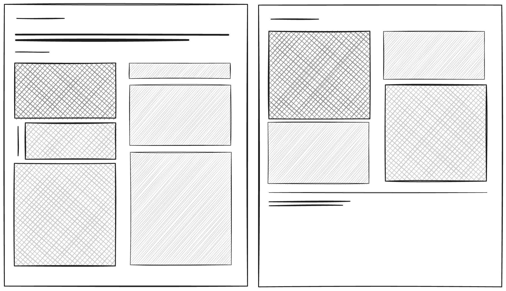
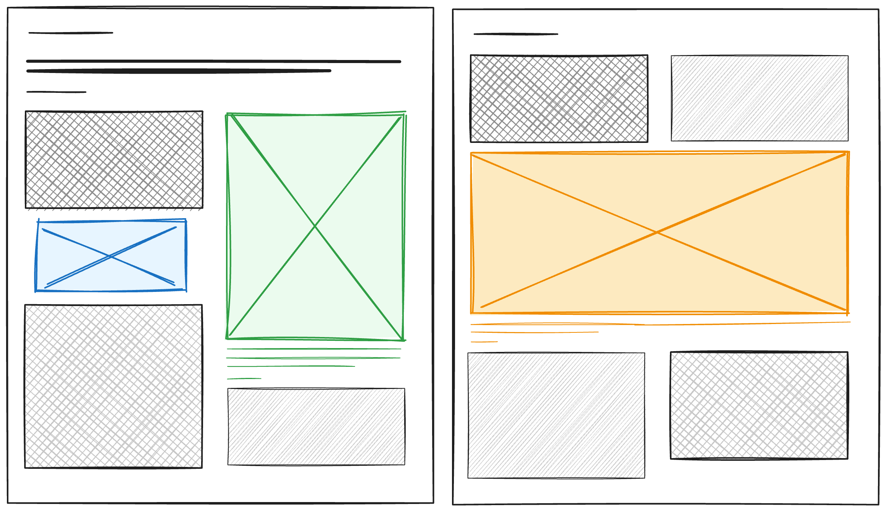
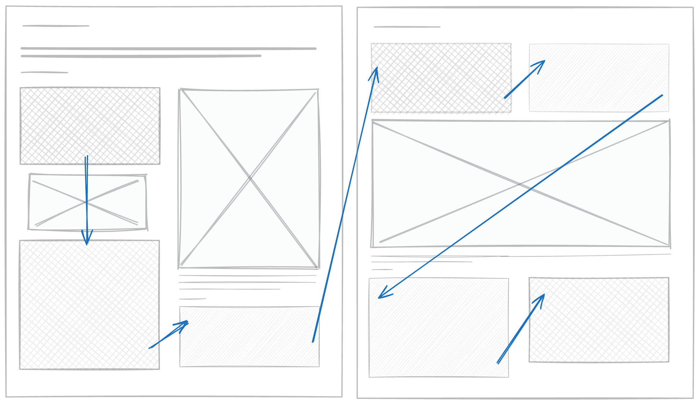

Vor Monaten, wahrscheinlich Jahren, habe ich bei irgendwem gesehen, wo das Print-Layout für einen Blog hübsch gemacht wurde. Nicht, weil man musste, sondern weil man konnte.

Und ich muss sagen: Recht haben sie. Ausdrucken von Webseiten ist der Erfahrung nach einfach immer fies. Häufig gibt es riesige leere Abschnitte, weil irgendwas verschoben ist, der Text läuft meistens quer über die ganze DIN A4-Seite und ist schwierig zu lesen, und so weiter.



Gleichzeitig bekomme ich durch Uni und Forschung mit, wie wissenschaftliche Paper häufig _unglaublich_ hübsche Typographie haben. Auf die Kürze, was ich an ihnen liebe:

* In der Regel gibt es ein zweispaltiges Layout, welches ein entspanntes Lesen mit 8 bis 10cm Textbreite ermöglicht.
* Es gibt größere Jumbotron-Grafiken mit ihrer Bildunterschrift, welche die volle Breite nutzen, und kleinere Inline-Grafiken, die mit dem Text fließen
* Referenzen (also Links im Web) haben einen festen Platz und sind ausgedruckt nicht völlig nutzlos (wenngleich man dann eine URL oder eine DOI wieder abtippen muss).
* Sämtlicher Platz auf dem Papier wird sinnvoll verwendet.
* ... what not to love!!

Und dann dachte ich mir "CSS ist so weit gekommen, das muss doch technisch möglich sein". Ist es auch, wenngleich ich mir keine großen textsetzerische Künste zuschreibe.
Also nun hier meine Hacks, um diesen Blog ansehnlich zu machen, wenn man `⌘ + P` drückt (probier es hier gerne aus, wenn es sich anbietet!).
Ich habe alle Änderungen in eine extra `print.css`-Datei geschrieben, die am Anfang mit `@media print {` startet. Alle weiteren CSS-Blöcke sind in diesem Abschnitt einzufügen.

Für alle meine Änderungen am Pagelayout gilt das Diktat, dass ich für einzelne Blogeinträge keine Layout-Änderungen oder CSS-Sonderlocken bauen möchte. Ich möchte beim Blogpost schreiben nicht darauf achten müssen, wie das Layout am Ende aussieht, sondern das Layout sollte erstmal automatisch das Korrekte tun und ich mich auf meinen Text konzentrieren können.

# Zweispaltiges Layout

Das Layout als solches ist ziemlich schnell gemacht. Die "Single"-Seite des Blogs hat sowieso kaum Content außer dem Inhalt des Blogposts, und die äußeren Daten möchte ich gerne einspaltig / über die gesamte Breite gehend anzeigen. Die Idee für ein zweispaltiges Layout ist relativ klar:



Glücklicherweise machen die Browser Engines das Aufspalten in zwei Columns überraschend einfach, und bekommen das mit dem Textwrapping auch sinnvoll hin, wenn der Bereich über mehrere Seiten geht. Will heißen, der Text der ersten Spalte wrapped in die zweite Spalte (Seite 1, rechts) und dann erst auf Seite 2, links. Außerdem wird die letzte Seite so balanciert, dass die Spalten etwa gleich hoch sind und der Seitenfooter nah am Textende ist.

Für meinen Blog (your mileage _...ähh..._ Klassennamen may vary) wäre das CSS dann:
```css
article .body {
  column-count: 2;
  column-gap: 1.5em;
  orphans: 3;
  widows: 3;
}
```

Die `orphans` und `widows` Properties funktionieren [leider nicht in Firefox](https://developer.mozilla.org/en-US/docs/Web/CSS/orphans), sorgen aber bei den restlichen Browsern dafür, wie viele Zeilen eines Absatzes mindestens am Ende der letzten bzw. am Anfang der nächsten Spalte über sein müssen.

> Less is more!

Jetzt bin ich mit offenen Augen durch die -- zugegeben relativ ~~karge~~ minimalistische -- Webseite gegangen und hab mir überlegt, welche Komponenten der Webseite ich nicht brauchen würde, wenn ich mich auf den Content fokussieren will.
Dabei ist zum Beispiel die Top-Navigation mit den Links zu den Schlagworten, dem Dark-Mode-Toggle etc. rausgeflogen, relativ einfach über `display: none`. Außerdem hab ich einige Farbkleckse der Webseite wie die farbigen Überschriften-Marker entfernt. Bye bye!

# Typo-Grundlagen

An dieser Stelle hab ich auch das meiste andere typografische Layout angepasst, wobei für die letzten 20% wieder 80% der Zeit draufgegangen sind. Ohne Anspruch auf Vollständigkeit daher:

Gerade bei längeren Texten finde ich einen kleinen `parindent` drollig, um zu sehen, wann ein neuer Absatz losgeht. Das passiert mit dem `text-indent` Property, wobei ich Markdown-bedingt eine Außnahme für Absätze mit Bildern machen musste:

```css
p {
  margin-top: 0;
  text-indent: 15px;
  margin-block-end: 0.3em;

  &:has(img) {
      text-indent: 0;
  }
}
```

Die Überschriften sollten generell mit dem nächsten Content zusammenhängen, um eine Einheit darzustellen. CSS macht auch das einfach mit dem `break-after: avoid` Property:

```css
h1, h2, h3, h4, h5, h6 {
  font-size: 1.2rem;
  margin-top: 2em;
  break-after: avoid;
}
```

Anders als im Web-Layout, wo Code-Blöcke gerne auch X-Overflow haben können (wobei das sowieso vermieden werden sollte beim Code beschreiben), ist das im Print-Layout streng verboten. Im günstigsten Fall fehlt ein Teil des Codeblocks, im schlimmsten Fall läuft es unter die andere Spalte und macht den anderen Text auch noch unleserlich.
Stattdessen hab ich mich für einen Umbruch im Codeblock (Soft-Wrap quasi) entschieden und gleichzeitig beschrieben, dass der Codeblock (wenn möglich) in der selben Spalte bleibt:

```css
pre {
  white-space: pre-wrap;
  font-size: 0.7em;
  break-inside: avoid;
}
```

# Bilder und Fotos

Dieser Blog gibt mir die Möglichkeit, Fotos in einem größeren, hochqualitativeren Format als auf Social Media zu teilen.
Das mache ich zum Beispiel bei den Posts [zur spanischen Uni](), [zu den koreanischen Märkten]() und [dem Jamboree]().
Diese Fotos sind groß, vollformatig gar, und zeigen eine Kleinst-Vorschau-Version bevor die große Bilddatei läd (z.B. wenn man mal wieder mit Edge übers Land fährt).
Um die Fotos auch als technisches Handwerk darzustellen, schreibt [mein Hugo-Template](https://github.com/jeyemwey/blog-2022-december/blob/main/layouts/shortcodes/picture.html) automatisch die Blendenzahl der Aufnahme, die ISO-Zahl und den ausführlichen Alternativ-Text darunter.
Ich finde, das macht schon was her.

Diese Fotos möchte ich auch im Print-Layout möglichst groß darstellen, auch wenn für den möglichen Platzverbrauch ein Unterschied zwischen Hochkant- und Senkrechtbildern gemacht werden muss.
Das Hugo-Template macht sowieso schon Bild-Resizing-Operationen und kann recht leicht eine CSS-Klasse an den Container anfügen, falls das Bild `landscape` oder `portrait` ist.
Der Einfachheit halber kommen Portrait-Fotos immer in eine Spalte und quadratische und große Landscape-Bilder bekommen immer beide Spalten.



Insgesamt muss ich also Platz für drei Typen von Bildern finden:
1. Die Inline-Grafiken (ganz links), die den Text ergänzen (z.B. Screenshots oder Mockups wie hier) und im Text-Flow liegen. Bei diesen Bildern fehlen naturgemäß Aufnahme-Informationen.
2. Stehende Fotografien, die ihre Caption haben, und insgesamt etwas mehr Platz bekommen
3. Quere Fotografien, deren Caption auch zwei Spalten breit ist (um die Zusammen&shy;gehörig&shy;keit zum Text zu visualisieren) und welche den Textflow unterbrechen.

Leider ist es mir (bisher) noch nicht gelungen, Bildplatzierungen zu erzeugen, die mit `\begin{figure}[t!]` in LaTeX möglich wären; bei dem die Grafiken an den Beginn einer Seite oder Spalte fixiert sind.
Texte werden also mitunter vor und hinter einem Bild in einer Spalte liegen, wobei die `orphans/widows`-Regeln von oben beachtet werden sollten.
Das wäre wirklich noch das Sahnehäuptchen, ich bin aber nicht sicher ob CSS das einfach abbilden kann.

Die ersten beiden Layouts sind ehrlich gesagt ziemlich einfach, weil die bestehende Konfiguration schon das meiste tut. Um einen Spaltenumbruch zwischen Bild und Caption zu vermeiden, gibt es noch eine Break-Anweisung und etwas Platz drum herum:

```css
.imageWithCaption {
  break-inside: avoid;
  line-height: 1.2;

  img {
    margin-top: 2em;
    width: 100%;
  }
}
```

Und für zweispaltige Bilder kann ich mich nun an der `landscape`-Klasse bedienen, die mein Hugo-Template liefert.

```css
.imageWithCaption.landscape {
  column-span: all;
}
```

Auch hier ist CSS wieder smart, balanciert den Absatz vorm Bild zu zweispaltig zu Ende und startet nach dem Bild zwei neue Textspalten. Die Textabschnitte sind also "von oben nach unten" etwa so aligned, wobei die Bilder immer nur zwischen Absätzen auftauchen können (nicht wie in LaTeX).



Für meine begrenzten Anwendungsfälle bin ich wirklich zufrieden, was daraus geworden ist. Ein Großteil der Magie ist allerdings wirklich auf das Picture-Template gefallen, welches ich nochmal wann anders beschreiben muss.

# Linkliste

Zugegeben, auf ausgedrucktem Papier sind klickbare Links meistens recht nutzlos.
Ein meist blauer (oder violetter) Text aber ohne die Möglichkeit, das, was dahinter ist, zu erfahren, zeigt höchstens vergebene Chancen auf.

Die Article- und Reports-Welt hat da jedoch auch ein etabliertes System für und, um ehrlich zu sein: Ich _liebe_ aufgeräumte Bibliographie/&shy;References-Abschnitte in Büchern und wissenschaftlichen Arbeiten. Und ich könnte tagelang dabei zusehen, wie sich in meiner 80-Seiten-Thesis alle Zitatstellen auf einmal verändern, wenn ich einen anderen Bibliography-Style verwende, und selbst in Emails habe ich mir inzwischen angewöhnt, dass Links nicht den Text brechen sollten, sondern nur mit `[i]` im Text platziert werden und am Ende des Absatzes oder am Ende der Email die tatsächliche URLs zu finden sind.

Zurück zum Printlayout meines Mini-Blogs: Mit einer URL des Links, die man dann vom toten Baum abtippen kann, kann man wenigstens noch nachvollziehen, was die Autor*in ausdrücken wollte -- zumindest ist das dann die Hoffnung.

Die Umsetzung ist jedoch etwas komplexer, weil es (zumindest in meinem Blog-System) keine einfache Lösung gibt, die URL von dem Linktext zu trennen, und ich wirklich keine Lust habe, jeden Link zweimal pro Post zu dokumentieren.
Du _kannst_ jedoch den Frevel begehen, das von Markdown kompilierte HTML mithilfe von regulären Ausdrücken zu parsen, [so wie im Hugo-Discourse-Forum vorgeschlagen](https://discourse.gohugo.io/t/index-and-list-urls-from-content/8589/3).
Ich habe den Code noch angepasst, um Fußnoten und die Backlinks in den Fußnoten zu überspringen:

```go
<section class="links">
  Links
  <ol>
  {{ if .Content -}}
      {{ $.Scratch.Set "count" 0 }}

  {{ $urls := findRE "<a href=\"[^\"|\\\"]*\"" .Content -}}
  {{ range $url := $urls -}}

  {{ $url := (strings.TrimPrefix "<a href=\"" $url) -}}
  {{ $url := strings.TrimSuffix "\"" $url -}}
  {{ if
      or
          (or
              (strings.HasPrefix $url "#" )
              (strings.Contains $url "#fn:")
          )
          (strings.Contains $url "#fnref")
      }}
      {{ else }}
      {{ $.Scratch.Add "count" 1 }}

      <li><code>{{ $url }}</code></li>
      {{ end }}
  {{ end -}}

  {{ end -}}
	</ol>

	{{ if eq 0 ($.Scratch.Get "count") }}
  <span class="empty-state">(none)</span>
  {{ end }}
</section>
```

Mit diesem Block Template kommen die Links also unter dem eigentlichen Artikel in eine gemeinsame Liste, welche dann auch über beide Spalten geht. Es liest sich ja niemand im Prosa-Style alle Links durch, darum sehe ich den Benefit von zwei Spalten hier nicht so sehr.

Für das IEEE-Styling in der Linkliste nutze ich CSS-Counter, womit das HTML semantisch relativ unspannend ist (und einfach die _ordered list_ verwendet):

```css
ol {
  counter-reset: item;
  margin-left: 0;
  padding-left: 0.5em;

  li {
    display: block;
    margin-bottom: 0.5em;
    margin-left: 2em;

    &::before {
      display: inline-block;
      counter-increment: item;
      width: 2em;
      margin-left: -2em;
      content: "[" counter(item) "]";
    }

    code {
      font-size: 0.8em;
    }
  }
}
```

Nun braucht es noch die Verweise an den Links selbst. Hierfür gibt es ebenfalls einen CSS-Counter, der für jeden Link hochzählt und den aktuellen Wert hinter dem Link einführt:

```css
article section.body {
  counter-reset: links;

  a[href^="http://"],
  a[href^="https://"] {
    counter-increment: links;
  }

  a[href^="http://"]::after,
  a[href^="https://"]::after {
    content: " [" counter(links) "]";
  }
}
```

Und dann turned das ganz gut! Der Link bleibt natürlich erhalten, wenn man einen PDF-Viewer mit Link-Support hat.

# Fazit

So. Das war dann doch mehr Text und komplexer als gedacht (wobei mein CSS auch wirklich eingerostet ist). Ich bin mal gespannt, wie viele Leser*innen diesen Artikel tatsächlich als PDF oder ausgedruckt gelesen haben. Wahrscheinlich niemand, aber das ist auch okay. :3
