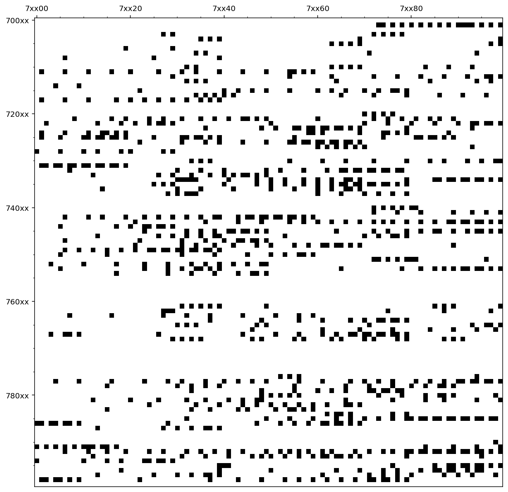

Manchmal sitzt man abends rum und fragt sich: "Der deutsche Postleitzahlenbereich ist mit _theoretisch_ einhunderttausend Kombinationen in `00000-99999` gar nicht so groß, wie viele Ziffern davon sind eigentlich in Benutzung?" Und dann liest man über die Wikipedia-Seite für Postleitzahlen, [amüsiert sich über Systeme mit führenden Nullen im Postleitzahlfeld](https://de.wikipedia.org/wiki/Datei:PLZ_fehlende_Fuehrungsnull.png), und stellt fest, dass sich da schon Leute ein System für ausgedacht haben.

Außerdem scheint es [super viele PLZ-Abschnitte zu geben](https://de.wikipedia.org/wiki/Postleitzahl_(Deutschland)#Postleitzahlenarten), die gar keinem Ort zugewiesen sind (Haus&shy;zu&shy;stell&shy;ungs&shy;post&shy;leit&shy;zahl, wie die Rapper sagen), sondern für Postfächer und Großempfänger wie Firmen reserviert sind.
Nach ein bisschen Wikidata-Massieren, ein wenig scrapen, ein bisschen googlen, bin ich dann aber zumindest über eine Liste der aktuell genutzten Haus&shy;zu&shy;stell&shy;ungs&shy;post&shy;leit&shy;zahlen gestolpert.

Jedes Quadrat-Bild bildet einen Zehntausender-Block ab, jede _Zeile_ ist ein Hunderter-Bereich, zum Beispiel von `12300` bis `12399`. Hier sind noch einmal die einzelnen Graphen für die Blöcke:



## 0xxxx

## 1xxxx

## 2xxxx

## 3xxxx

## 4xxxx

## 5xxxx

## 6xxxx

## 7xxxx

## 8xxxx

## 9xxxx

Es ist visualisiert, und [in den Zahlen sieht man es auch](https://de.wikipedia.org/wiki/Postleitzahl_(Deutschland)#Postleitzahlenarten), es sind nur etwa 8% des Postleitzahlenbereiches als Hauszustellungspostleitzahlen und nur etwa 28% überhaupt verwendet. Über eine Erschöpfung des Zahlenraums muss man sich wohl keine Gedanken machen. Yay!

Leider enthalten die Postleitzahlen keine Fehler&shy;korr&shy;ektur&shy;funk&shy;tionen wie bei IBANs oder IMEI-Nummern, mit denen man die Korrektheit einer PLZ kontrollieren kann. In den meisten Fällen würde eine falsche Postleitzahl jedoch sowieso nur eine _Service Degradation_ (sprich: Jemand müsste eine Postleitzahl manuell nachkodieren und das verzögert den Empfang) und keinen _Service Loss_ (der Brief wird gar nicht zugestellt) bedeuten, sodass eine kürzere Zahlenfolge nach&shy;voll&shy;zieh&shy;barer&shy;weise präferiert wird.

