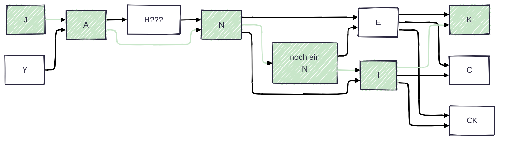

Es ist nicht immer einfach mit meinem Namen. Liebe Grüße auch an alle Phillipp'se dieser Welt!

```mermaid
---
config:
  theme: redux
  look: handDrawn
  layout: elk
---
flowchart LR
    J["J"] --> A["A"]
    A --> N["N"] & H["H???"]
    Y["Y"] --> A
    N --> E["E"] & I["I"] & NN["noch ein<br>N"]
    NN --> E & I
    E --> K["K"] & C["C"] & CK["CK"]
    I --> K & C & CK
    H --> N
    style J fill:#C8E6C9
    style A fill:#C8E6C9
    style N fill:#C8E6C9
    style I fill:#C8E6C9
    style NN fill:#C8E6C9
    style K fill:#C8E6C9
    linkStyle 0 stroke:#C8E6C9,fill:none
    linkStyle 1 stroke:#C8E6C9,fill:none
    linkStyle 6 stroke:#C8E6C9,fill:none
    linkStyle 8 stroke:#C8E6C9,fill:none
    linkStyle 12 stroke:#C8E6C9,fill:none

```
