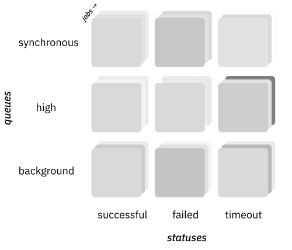
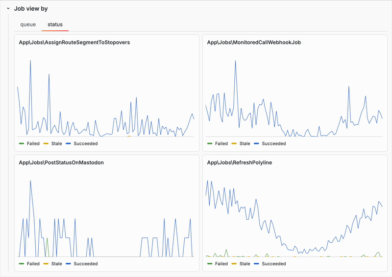
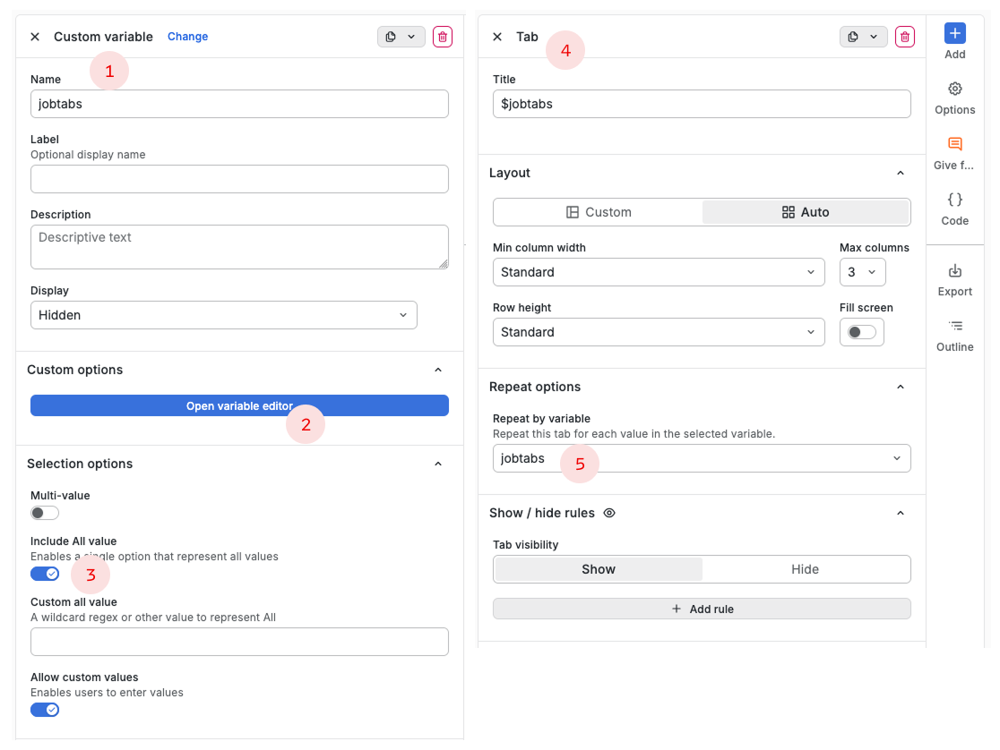

Ich sehe gerade zum ersten Mal das neue Tab-Feature in [Grafana 13](https://grafana.com/blog/grafana-13-release-all-the-latest-features/), und die sind ja mal super hübsch!

Wir monitoren bei [Träwelling](https://traewelling.de) die Hintergrundaufgaben, in dem nach jeder Aufgabe genau eine dieser Counter befüllt wird:



Die Prometheus-Metrik hat also drei Label:

```
trwl_jobs_count{job_name="PostStatusOnMastodon", queue="high", status="Succeeded"} 69
trwl_jobs_count{job_name="PostStatusOnMastodon", queue="high", status="Failed"} 23
trwl_jobs_count{job_name="PostStatusOnMastodon", queue="background", status="Succeeded"} 42
```

Eine Hintergrundaufgabe kann, je nach Konfiguration oder dynamischem Code in eine oder mehrere `queues` gesteckt werden, sodass wir das Umschalten gerne betrachten würden.

Mit den neuen Grafana-Tabs kann ich nun zwischen den Labeln, nach denen ich gruppieren will, hin und her schalten!



Dazu habe ich eine "Custom"-Variable `$jobtabs` angelegt mit den Werten `queue,status` und in den Tab-Einstellungen danach repeated:



Nun kann ich die Variable in der Aggregatsfunktion der Query benutzen:

```diff
  sum
+ by($jobtabs)
  (rate(trwl_jobs_count{job_name=~"$jobnames"}[$__rate_interval]))
```

... und so zwischen den Gruppierungen hin- und hertauschen.

`$jobnames` ist an der Stelle die Variable mit dem Set der Hintergrundaufgabe-Namen, mit dem der Graph wiederholt wird (das ist aber nicht neu in Grafana 13).

Ich mag das Feature voll :))
